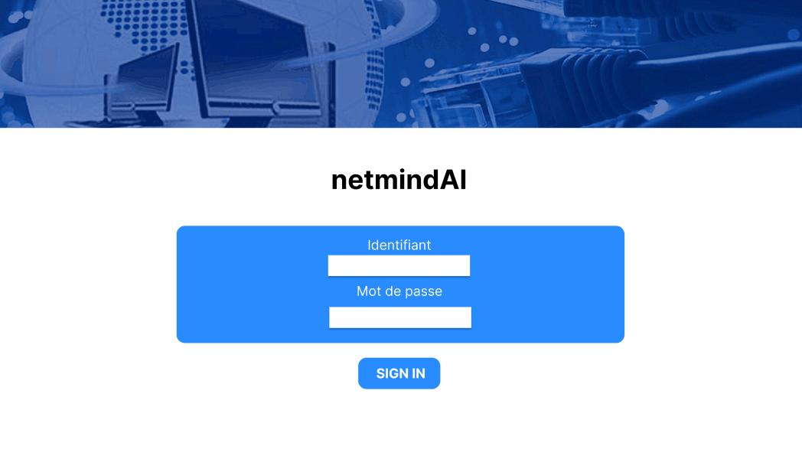
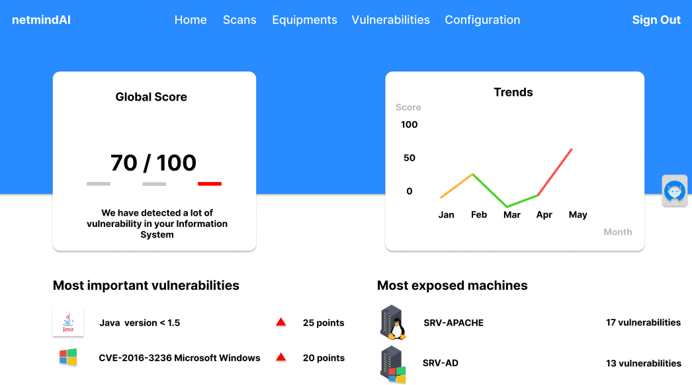
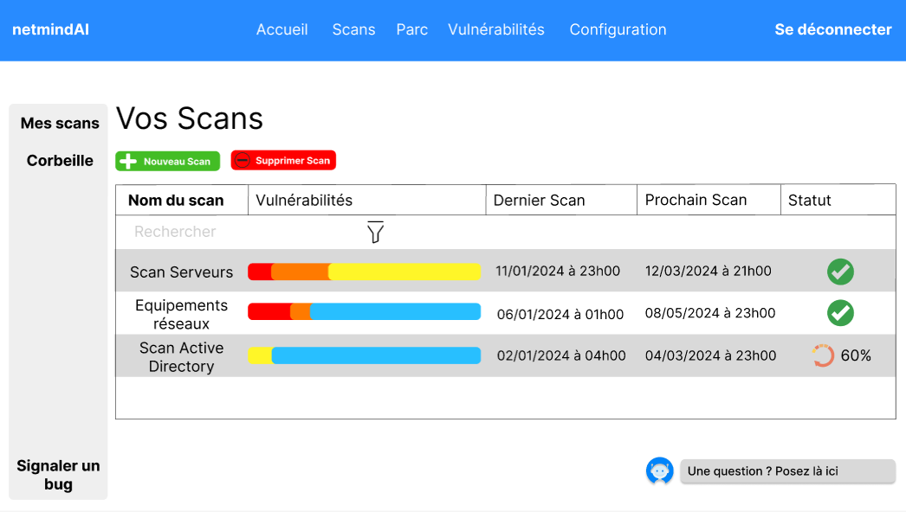
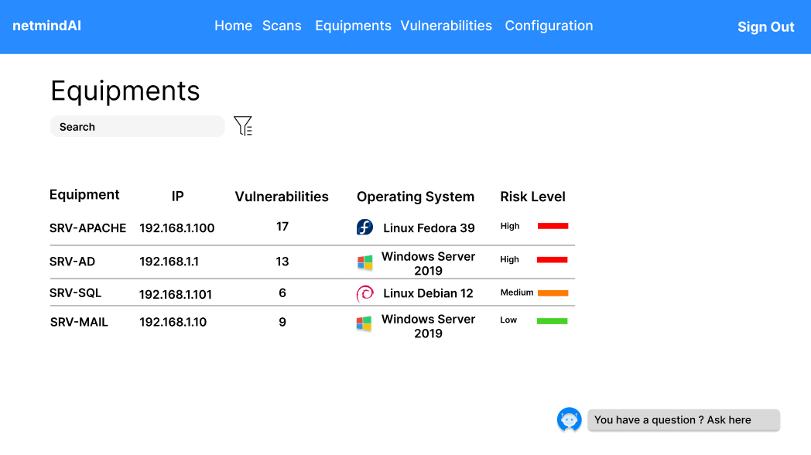
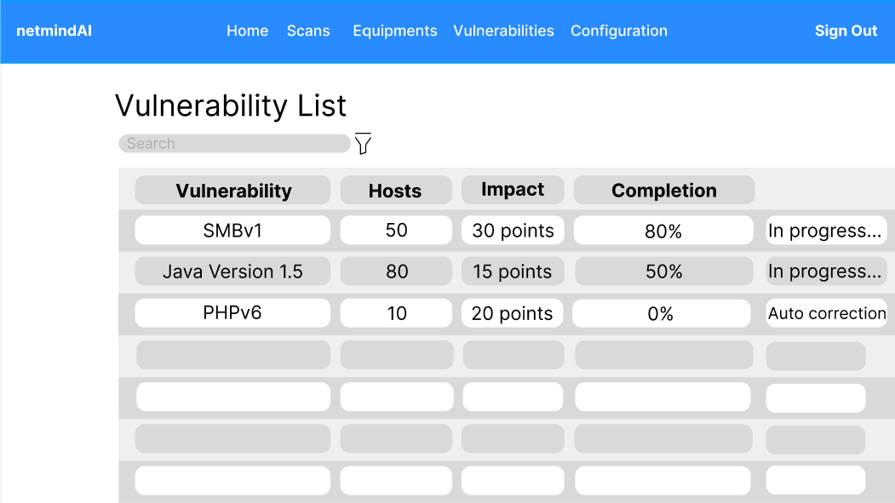
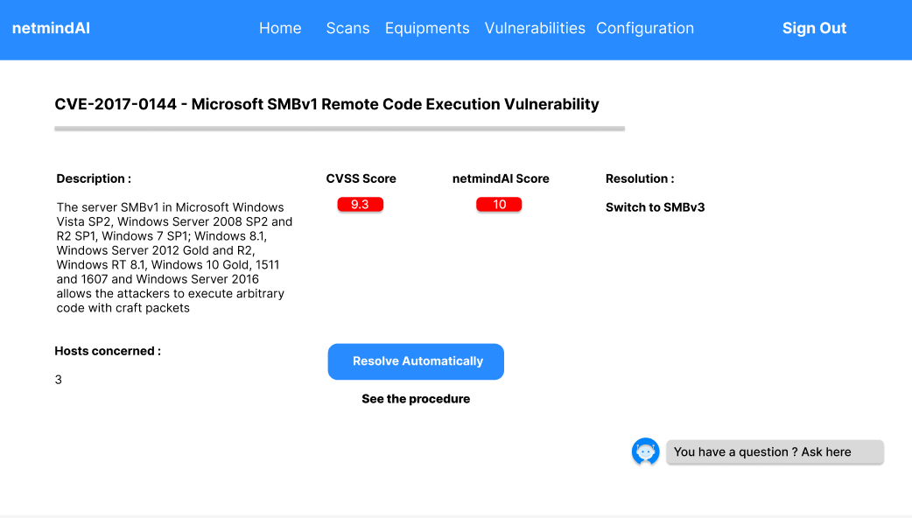

# Cybersecurity AI App

## Overview

Project Target:

The targets of our project are small and medium-sized enterprises (SMEs). These entities have limited financial means and/or internal resources and may not necessarily have the luxury to invest (either in time or money) in an optimal network infrastructure in terms of cybersecurity.

The Problem:

Despite the increasing number of cyber attacks every day, some organizations do not allocate dedicated resources to cybersecurity (technologies, human resources, processes, etc.). This observation is even more significant within small and medium-sized enterprises (SMEs) as these organizations have very limited resources, making them highly vulnerable to increasingly frequent cyber attacks (60% of attacked SMEs do not recover and go bankrupt within 18 months following the attack).

This lack of consideration can have significant consequences for organizations (loss of reputation, service unavailability, cost of problem resolution, legal actions, organization closure).

The Solution:

Introduce an AI-based solution that assists Chief Information Officers (CIOs) in maintaining the security level of their organizations.

Value Proposition:

Unlike other solutions on the market, ours focuses on SMEs by constructing an AI capable of correlating potential vulnerabilities with previously occurred attack cases in the same sector (meaning that if another SME has recently experienced a certain type of attack, our AI will prioritize patching for that specific type of attack). It offers a range of automated actions to save time for your CIO in implementing patches for these vulnerabilities. Finally, it aims to be as effective as possible by prioritizing vulnerabilities based on the organization's context to focus primarily on the most dangerous vulnerabilities affecting the operation of your organization.

## Screenshots

*Caption for Screenshot 1*

HomepageDashboard
*Caption for Screenshot 2*

 
*Caption for Screenshot 3*

*Caption for Screenshot 4*

 /
*Caption for Screenshot 5*

*Caption for Screenshot 6*

## Features

List the key features of your app:

- **Patch Management:** Describe how your app handles patching to mitigate frequent cyberattacks.
- **AI Detection:** Highlight the AI capabilities for detecting and preventing cyber threats.
- **User-Friendly Interface:** Mention if your app has an easy-to-use interface for users.

## Installation

The application is in draft stage, installation instructions will be provided later.

## Usage

Explain how users can use your app effectively to enhance their network security.

## Support and Feedback
If you want help us we can fill the form :
https://docs.google.com/forms/d/e/1FAIpQLSeBufihSa6BncvYvbLnaB3_567Ygbl2yPazZQ7DiWjr6llfSw/viewform?usp=sf_link

## Conclusion

Wrap up with a brief conclusion, emphasizing the importance of your app in bolstering cybersecurity.
